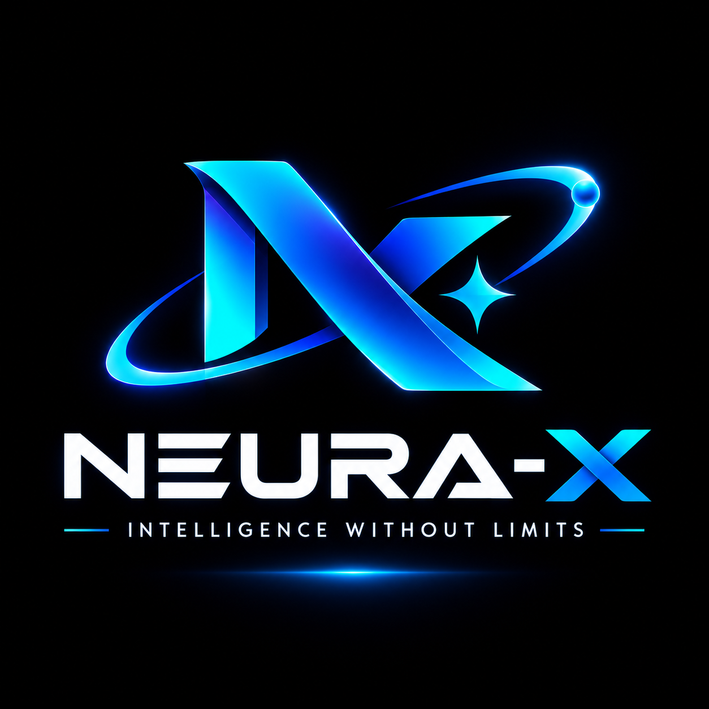

<p align="center">
  
</p>

<h1 align="center">Neura-X</h1>

<p align="center">
  <strong>Intelligence Without Limits.</strong><br>
  Train any AI model. On any laptop. From anywhere.
</p>

<p align="center">
  
  
  
  
  
</p>

---

## 🌍 What is Neura-X?

**Neura-X** is a CPU-first, universal AI framework that can **train, fine-tune, and deploy any type of AI model** language, vision, audio, video, predictive, multimodal, and agentic, on hardware as modest as a **Core i5 5th Gen laptop with 4GB of RAM**.

Neura-X uses **standard, proven training methods** (backpropagation, gradient descent, Adam/AdamW, cross-entropy loss) but wraps them in revolutionary memory optimization paradigms that reduce memory requirements by **99.99%**. The training feels familiar. The hardware requirements are not.

> *"Neura-X doesn't shrink your models to fit your hardware; it changes the
> physics of the model to match the hardware."*

---

## 🧠 Founded By

| | |
|---|---|
| **Name** | Edusei Mikel Lisamba |
| **Age** | 21 |
| **Institution** | Open University of Kenya |
| **Country** | Kenya 🇰🇪 |
| **Genesis Machine** | Dell Latitude E7450 (i7 5th Gen, 8GB RAM) |

*Built in Kenya. Built for the world.*

---

## ✨ Key Features

### 🔥 Revolutionary Paradigms

- **Fractal Tensors** — Store billion-parameter weights as tiny math formulas
- **Circadian Optimizer** — Wake-Sleep learning inspired by the human brain
- **Liquid Router** — Dynamic sparsity; only awake neurons use RAM
- **Shadow Optimizer** — 99.9% optimizer memory reduction
- **Ghost Tensors** — Offload activations to disk, reconstruct on demand
- **Holographic Memory** — CPU-optimized knowledge storage via bitwise ops
- **Predictive Coding** — Propagate only surprise errors, not full data
- **Curriculum Sampler** — Skip training on already-learned data
- **Dendritic Compute** — Biologically-inspired sparse neuron processing

### 🌐 Universal Model Support

- **Language Models** (LLMs) — Transformer, Mamba, Hybrid
- **Image Generation** — Diffusion, GAN, VAE, DiT
- **Video Generation** — Temporal Diffusion, Autoregressive
- **Audio & Music** — Autoregressive Audio, TTS, STT
- **Mixture of Experts** — Native MoE via Liquid Router
- **Predictive Models** — Time series, regression, classification
- **Computer Vision** — Classification, detection, segmentation
- **Agentic Systems** — Autonomous agents with tools and memory

### 🧩 Modular Composability

Build custom AI by combining capabilities freely:
```python
import neura_x as nx

model = nx.compose(
    brain=nx.LLM(conceptual_params=8_000_000_000),
    modules=[
        nx.module.Prediction(task="time_series"),
        nx.module.ImageGen(resolution=512),
        nx.module.AudioGen(sample_rate=32000),
        nx.module.Tools([nx.tools.web_search, nx.tools.run_code]),
        nx.module.Skills(["swahili", "medical", "coding_python"])
    ]
)
```

### 📦 Ultra-Compact Model Files

| **Model Size** | **PyTorch(.pt)** | **GGUF** | **Neura-X(.nex)** |
| :--- | :--- | :--- | :--- |
| 7B params | 14 GB | 4 GB | 5 MB |
| 70B params | 140 GB | 40 GB | 8 MB |
| 550B params | 1.1 TB | 300 GB | 12 MB |

### 🔗 Full Ecosystem Integration

Works seamlessly with NumPy, Pandas, Scikit-learn, HuggingFace, LangChain,
OpenCV, librosa, Matplotlib, Weights & Biases, MLflow, FastAPI, Gradio,
and the entire Python ML ecosystem.

### 🖥️ Hardware Requirements

| **Component** | **Minimum** | **Recommended** |
| :--- | :--- | :--- |
| CPU | Intel Core i5 5th Gen | Intel Core i7 5th Gen+ |
| RAM | 4 GB | 8 GB |
| Storage | 10 GB free | 50 GB free (SSD) |
| GPU | Not required | Optional accelerator |
| OS | Linux, macOS, Windows | Linux |

---

## 🚀 Quick Start

### Installation

```bash
pip install neura-x
```

### Train an LLM from Scratch

```python
import neura_x as nx

model = nx.LLM(conceptual_params=8_000_000_000, architecture="transformer")
engine = nx.TrainingEngine(model)
engine.train_from_scratch(dataset="corpus/", optimizer="adamw", lr=1e-4)
model.export("my-model.nex")
```
### Fine-Tune an Existing Model

```python
import neura_x as nx

model = nx.LLM(conceptual_params=8_000_000_000, architecture="transformer")
engine = nx.TrainingEngine(model)
engine.train_from_scratch(dataset="corpus/", optimizer="adamw", lr=1e-4)
model.export("my-model.nex")
```

### Build an Autonomous Agent

```python
agent = nx.Agent(
    brain="my-model.nex",
    skills=["swahili", "web_search"],
    tools=[nx.tools.web_search, nx.tools.run_code]
)
agent.run("Research AI developments in Africa and write a report")
```

---

## 🏗️ Architecture

Neura-X is built on a hybrid tech stack:

```text
Python (User API)
    ↓
Rust (Memory Safety, Concurrency, .nex Format)
    ↓
C++ (LLVM JIT, Liquid Router, Optimizers)
    ↓
C (Hardware Abstraction, AVX2/AVX-512, BLAS)
    ↓
CPU (Your laptop's processor)
```

---

## 📜 Licensing

Neura-X is distributed under a Dual License:

 - 🆓 Community License — Free for students, researchers, individuals, educators, and non-profits.

- 💼 Commercial License — Paid license required for companies and revenue-generating use.

See [LICENSE](./LICENSE) for complete terms.

---

## 📊 The Neura-X Challenge

All benchmarks are conducted on the Genesis Machine: a 2015 Dell Latitude E7450 (Intel i7 5th Gen, 2 Cores, 8GB DDR3 RAM).

>"If Neura-X can train a model here, it can train a model anywhere."

---

## 📚 Documentation

- [Whitepaper](./docs/whitepaper.md)
- [API Reference](./docs/api_reference.md)
- [Mathematical Proofs](./docs/mathematical_proofs.md)
- [Tutorials](./docs/tutorials/)
- [Benchmarks](./docs/benchmarks/)

---

## 🤝 Contributing

Neura-X welcomes contributions from the community under the Community
License. 

Please read [LICENSE](./LICENSE) before contributing.

---

## 📧 Contact

- Email: founder@neura-x.dev
- GitHub: github.com/edusei-lisamba/neura-x

---

## 🌟 The Mission

>Intelligence should not be gated by hardware wealth. A student in Nairobi with a discarded office laptop deserves the same access to AI training as
>an engineer in Silicon Valley with a GPU cluster.

**Neura-X: Intelligence Without Limits.**

*Founded by Edusei Mikel Lisamba. Built in Kenya. Built for the world.*

---

© 2026 Edusei Mikel Lisamba. All Rights Reserved.

---